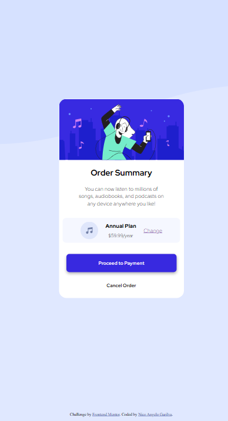

# Order Summary Card

This is a solution to the **Order Summary Card challenge** from Frontend Mentor.

## 📸 Screenshot

## 🔗 Links

- Live Site: (https://github.com/nico-devstudio/order-summary-card)
- GitHub Repo: (https://github.com/nico-devstudio)

## 🚀 Built with

- HTML5
- CSS3
- Flexbox
- CSS Grid
- Google Fonts

## 🎯 What I learned

- How to center elements using CSS Grid
- How to use Flexbox for layout
- How to create hover effects on buttons
- How to use box-shadow for modern UI design

## 🧠 Continued development

I want to improve my:
- Responsive design skills
- CSS positioning
- UI/UX spacing and layout consistency

## 👤 Author

- Name: Nico Angelo Garilva
- Frontend Mentor: https://www.frontendmentor.io?ref=challenge
 
